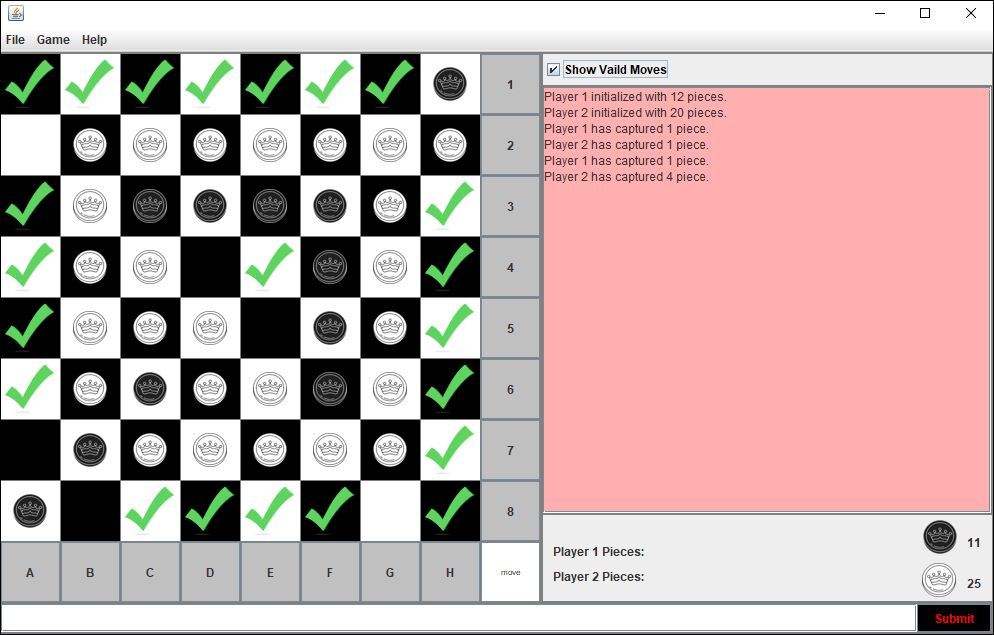

<!-- PROJECT LOGO -->
 

  <h3 align="center">Othello Game</h3>

<!-- ABOUT THE PROJECT -->
## About The Project
### A minute to learn ... a lifetime to master!

Othello is a traditional two-player strategy game in which each player aims to have pieces of their colour make up the majority of the pieces on the board at the end of the game.

### Built With
* Java 
* Swing
* Eclipse 

  

